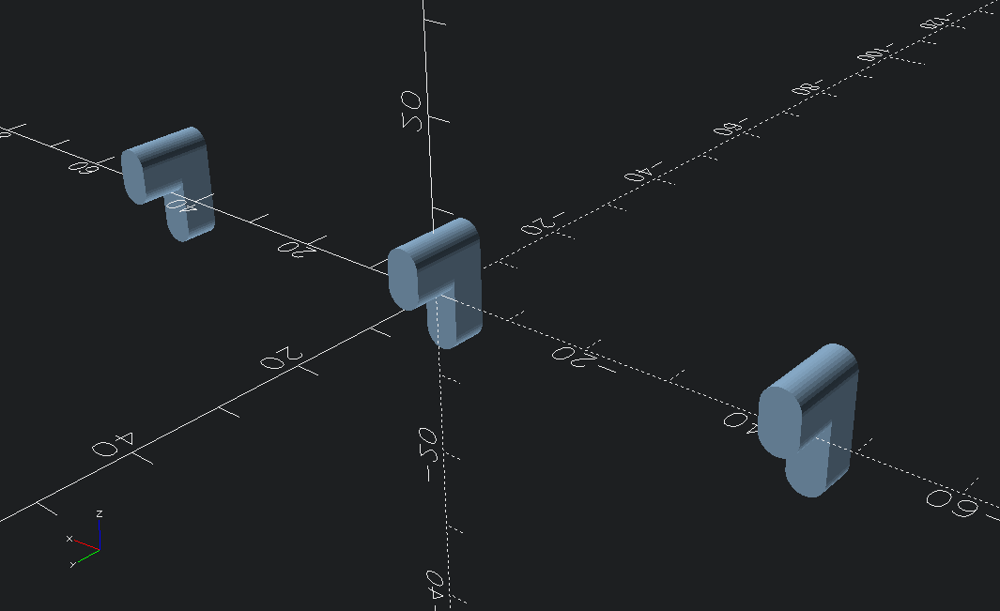

# OpenScad-Libraries
Various Libraries I've made for use with OpenScad and BOSL2

## Libraries

### dice.scad
A library of 2D BOSL2 regions depicting the standard dice used in TTRPGs such as Dungeons and Dragons

### logging.scad
A library to help with logging to keep the output window clean except when logs are needed

### skadis.scad
A library to help with designing items for the Ikea Skadis pegboard making use of BOSL2 attachments

